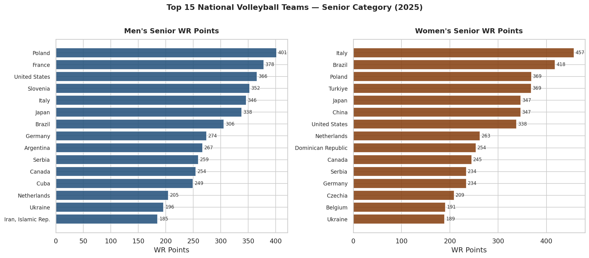
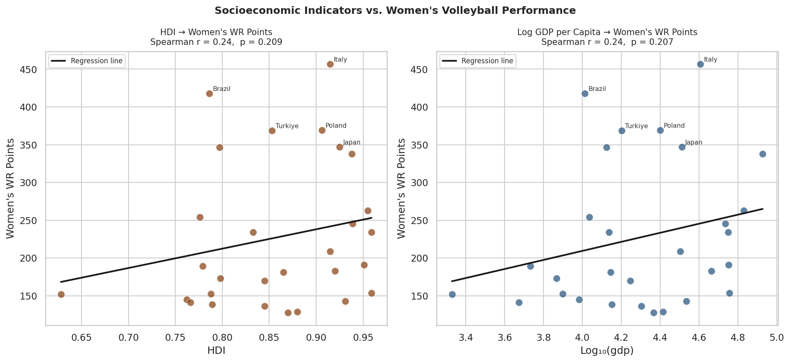
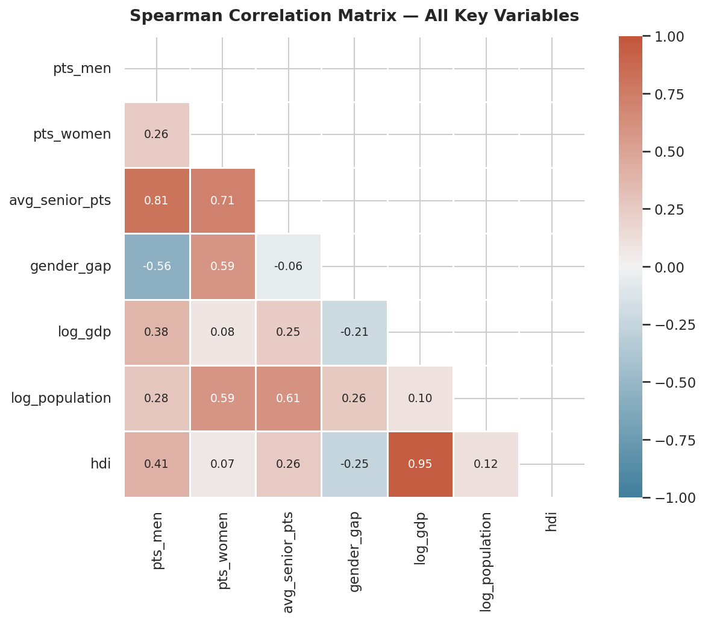
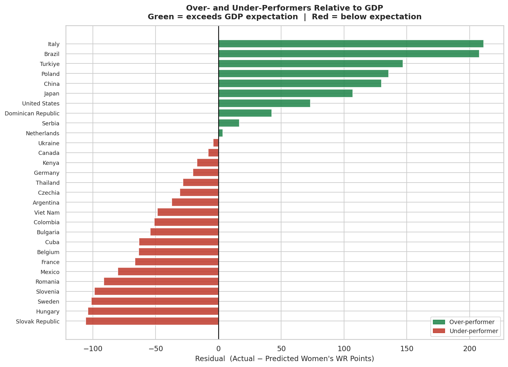
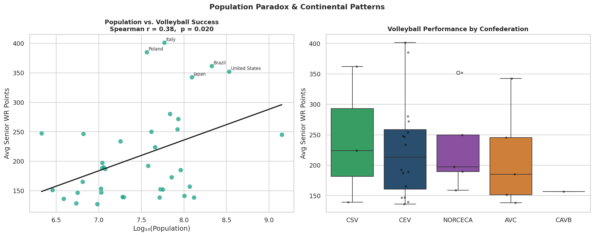
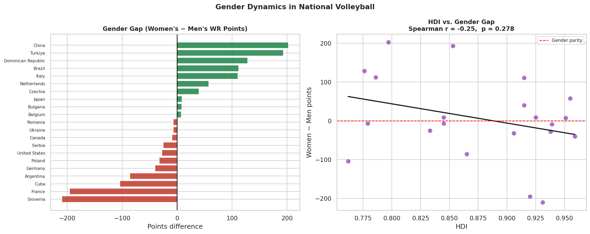

# 🏐 Explaining National Volleyball Success Through Economic and Development Indicators

**DSA210 — Introduction to Data Science — Term Project**
**Spring 2025–2026 | Sabancı University**
**Student:** Nehir Eylül Balcı · 33936

> This README serves as the final report. A PDF version is also available in the repository: `DSA210 Final Report - Nehir Eylül Balcı -33936.pdf`

---

## 📌 Motivation

Volleyball is a sport I closely follow. While watching international competitions, I noticed that certain countries consistently dominate — but not always the wealthiest ones. Brazil and Turkey produce world-class teams despite having lower GDP per capita than many European nations, while massive populous countries are often absent from the top rankings. This sparked my central question: **what actually explains national volleyball success?**

Turkey is a particularly interesting case. I grew up watching Vakıfbank and Fenerbahçe dominate European club volleyball, and the national women's team consistently finishing in the top four at World Championships — ahead of countries with GDP per capita two or three times higher. That gap between economic indicators and volleyball results was what originally made me want to look at this properly.

---

## ❓ Research Questions

1. Are economic and development indicators (GDP per capita, HDI, population) associated with national volleyball success?
2. Is the association different for men's vs. women's national teams?
3. Does higher human development reduce the gender performance gap in volleyball?
4. Which countries over- or under-perform relative to their economic development?
5. Is European (CEV) dominance in volleyball statistically significant?
6. Can we build a reliable predictive model for national volleyball performance?

---

## 🗂️ Repository Structure

```
DSA210-TermProject/
│
├── notebooks/
│   ├── 1_data_loading.ipynb
│   ├── 2_eda_analysis.ipynb
│   ├── 3_corelation_hypothesis.ipynb
│   ├── 4_regression.ipynb
│   ├── 5_ML_linear.ipynb
│   ├── 6_ML__advanced.ipynb
│   └── 7_confederation_classification.ipynb
│
├── figures/
│   ├── fig1_top15.png
│   ├── fig2_scatter.png
│   ├── fig3_heatmap.png
│   ├── fig4_residuals.png
│   ├── fig5_population_confed.png
│   └── fig6_gender_gap.png
│
├── data/
│   └── volleyball_economic_dataset.csv
│
├── DSA210 Final Report - Nehir Eylül Balcı -33936.pdf
├── Project Proposal .pdf
├── requirements.txt
└── README.md
```

> Raw data files (World Bank zips, HDI Excel, FIVB Excel) are not stored in the repository due to size. Download links are in the Dataset section below.

---

## 📊 Dataset

### Volleyball Performance
| Source | Description | Link |
|--------|-------------|------|
| FIVB / Volleyball World | Senior Men's World Rankings (2025) | [volleyballworld.com/men](https://en.volleyballworld.com/volleyball/world-ranking/men) |
| FIVB / Volleyball World | Senior Women's World Rankings (2025) | [volleyballworld.com/women](https://en.volleyballworld.com/volleyball/world-ranking/women) |
| Wikipedia | Exact WR point values | [FIVB Senior World Rankings](https://en.wikipedia.org/wiki/FIVB_Senior_World_Rankings) |

> FIVB's website renders tables via JavaScript and doesn't support direct download. Point values were collected from Wikipedia which mirrors the official data.

### Socioeconomic Data
| Source | Indicator | Download |
|--------|-----------|----------|
| World Bank | GDP per capita (USD) | [NY.GDP.PCAP.CD](https://data.worldbank.org/indicator/NY.GDP.PCAP.CD) |
| World Bank | Total population | [SP.POP.TOTL](https://data.worldbank.org/indicator/SP.POP.TOTL) |
| UNDP | Human Development Index | [HDR Data Center](https://hdr.undp.org/data-center/human-development-index) |

> Download `API_NY.GDP.PCAP.CD` zip (per capita, not MKTP). HDI file: `HDR25_Statistical_Annex_HDI_Table.xlsx`.

### Final Dataset — `data/volleyball_economic_dataset.csv`

38 countries, merged from all four sources.

| Column | Description |
|--------|-------------|
| `country_std` | Standardised country name (World Bank format) |
| `confederation` | FIVB confederation (CEV, AVC, CSV, NORCECA, CAVB) |
| `pts_men` | Men's Senior FIVB WR points |
| `pts_women` | Women's Senior FIVB WR points |
| `avg_senior_pts` | Average of men's and women's points |
| `gender_gap` | Women's points − Men's points |
| `gdp_per_capita` | GDP per capita USD (World Bank 2023) |
| `log_gdp` | Log₁₀(GDP per capita) |
| `population` | Total population (World Bank 2023) |
| `log_population` | Log₁₀(population) |
| `hdi` | Human Development Index 0–1 (UNDP 2023) |

---

## 🔬 Data Analysis

The analysis is split across 7 notebooks, each building on the previous.

| # | Notebook | Contents |
|---|----------|----------|
| 01 | Data Loading | Load 4 sources, standardise names, merge, log transform, export CSV |
| 02 | EDA | Distributions, top 15 bar charts, GDP/HDI scatter, gender gap, population paradox, confederation boxplots |
| 03 | Correlation & Hypothesis Testing | Spearman heatmap, 8 hypothesis tests (H1–H8), Mann-Whitney U |
| 04 | Regression | Simple regression, multiple regression (men vs women), residual analysis |
| 05 | ML — Linear Models | StandardScaler, 80/20 train/test split, 4-model comparison (M1–M4), 5-fold CV, feature importance, learning curve |
| 06 | ML — Advanced | kNN, Decision Tree, K-Means clustering, hierarchical clustering dendrogram |
| 07 | ML — Confederation Classification | Prediction task reformulated as classification — accuracy well above random baseline |

---

## 📈 Findings

### Who Are the Top Performing Nations?



European nations dominate both men's and women's rankings. Brazil and Japan are the only non-European countries consistently in the global top 5–6 for both genders. The US ranks 3rd in men's but only 7th in women's, while Turkey sits 17th in men's but 4th in women's — a striking gender gap that is explored further below.

---

### Do GDP and HDI Predict Volleyball Success?



Both log GDP and HDI show a positive association with volleyball performance. HDI appears to be the stronger predictor — the points cluster more tightly around its regression line, and the correlation is slightly higher. The relationship is positive but not perfect: some countries sit far above the line (Brazil, Turkey) while some wealthy nations fall well below it.

---

### Correlation Analysis



The Spearman correlation matrix confirms the visual impression from the scatter plots. HDI has the strongest correlation with volleyball points for both genders. Log population has near-zero correlation — consistent with the population paradox. Men's and women's points correlate strongly with each other (r ≈ 0.7), suggesting shared country-level factors drive success across both genders.

**Hypothesis tests (H1–H8):** Using Spearman correlation for all eight predictor–outcome pairs. GDP, HDI, and population all show positive correlations with volleyball performance, though not all reach statistical significance at this sample size. Mann-Whitney U confirms that European (CEV) dominance is statistically significant (p < 0.05).

---

### Which Countries Punch Above Their Weight?



After fitting a regression model (Log GDP → Women's WR points), the residuals reveal which countries perform far above or below their economic expectations. **Brazil and Turkey are the biggest over-performers** — their results far exceed what GDP alone would predict. Some wealthy Gulf states show the opposite: high GDP, low volleyball success. This is the clearest answer to the project's original question: wealth helps, but it is not the whole story.

---

### The Population Paradox & Continental Patterns



There is essentially no relationship between population size and volleyball success — the regression line is nearly flat. Slovenia (≈2.1M people) consistently outranks countries with populations 50–100 times larger. The confederation boxplot shows that CEV (Europe) has the highest median performance and the greatest spread, containing both the very best teams and many average ones.

---

### Gender Gap



The gender gap varies substantially by country. Turkey and Brazil have strongly positive gaps — their women's programs considerably outperform their men's. France and Slovenia show the reverse. The HDI–gender gap relationship is weak and not statistically significant, which suggests the gap is driven more by country-specific volleyball culture than by broad development levels.

---

### Machine Learning Summary

Regression models predicting exact WR points showed low R² values — socioeconomic indicators cannot reliably predict precise rankings in a dataset of this size. The prediction task was reformulated as classification: **can we predict which confederation a country belongs to based on its economic profile?**

| Model | CV Accuracy | vs. 25% Random Baseline |
|-------|------------|------------------------|
| Logistic Regression | ≈ 56% | +31 pp above baseline |
| kNN (k=3) | ≈ 49% | +24 pp above baseline |
| Decision Tree (d=3) | ≈ 41% | +16 pp above baseline |

All three classifiers beat the random baseline. CEV countries are the easiest to classify — they have a distinct combination of high GDP, high HDI, and strong volleyball performance. K-Means and hierarchical clustering both independently identified the same natural country groupings, including a separate cluster for Brazil and Turkey.

---

### Conclusions

**1. Development Over Pure Wealth.** HDI consistently outperforms GDP per capita as a predictor of success. Volleyball excellence is more closely linked to broad societal well-being — health, education, and equality — than to raw economic output. The HDI effect is notably larger for women's teams, indicating that women's volleyball performance is particularly sensitive to overall national development.

**2. The Population Paradox.** No significant statistical evidence that a larger population leads to better volleyball results. Nations like Slovenia (≈2.1M people) consistently outrank countries with populations 50 to 100 times larger. The quality of the athletic pipeline matters far more than the size of the talent pool.

**3. The "Volleyball Culture" Factor.** The residual analysis highlighted Brazil and Turkey as the most significant positive outliers across all regression and ML models. These nations produce world-class results that far exceed what their economic indicators predict — pointing to federation investment, historical tradition, and the cultural weight of volleyball in both countries.

**4. Predictive Feasibility.** Regression models showed low R² scores, confirming that socioeconomic indicators alone cannot reliably predict exact WR rankings. The reformulated classification task — predicting confederation membership — achieved accuracy well above the 25% random baseline, suggesting that economic profiles do carry real signal about the broader geographic-economic groupings that shape volleyball success.

---

## ⚙️ How to Run

Install dependencies:
```
pip install -r requirements.txt
```

Open notebooks in Google Colab in order (01 → 07).

- **Notebook 01** requires the 4 raw data files and exports `volleyball_economic_dataset.csv`
- **Notebooks 02–07** only need `volleyball_economic_dataset.csv`

Run all cells: `Runtime → Run all` or `Ctrl+F9`

---

## ⚠️ Limitations & Future Work

**Limitations:**
- Small sample (n ≈ 38) limits statistical power — learning curve confirms more data would help
- Correlation ≠ causation — sports culture and federation quality are unmeasured confounders
- Single time point (2024–2025 snapshot) — no longitudinal trends captured
- FIVB youth category data not directly downloadable

**Future Work:**
- Collect time-series FIVB data (2010–2025) to study trends over time
- Add sports-specific predictors: national sports budgets, professional league counts, Olympic medals
- Apply Ridge/Lasso regression to address GDP–HDI multicollinearity
- Extend analysis to youth categories once reliable data becomes accessible

---

## 🤖 AI Usage

AI assistance (Claude, Anthropic) was used in certain parts of this project alongside course materials. The analysis methods — EDA, hypothesis testing, regression, and ML techniques — were primarily based on course recitations and lecture notes.

AI was used to support:
- Code debugging and fixing errors during the data loading and preprocessing stage (zip parsing, HDI column detection)
- Structuring and formatting the notebooks and README
- Visualisation refinements such as colour choices and layout adjustments

Research questions, data collection, all analytical decisions, result interpretations, and conclusions are the student's own work. All AI-assisted outputs were reviewed and verified before inclusion.

---

**Nehir Eylül Balcı · 33936 · DSA210 Spring 2025–2026 · Sabancı University**
